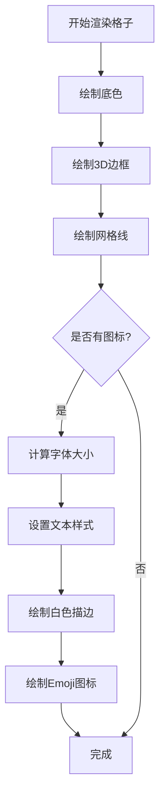

# 地形图标修复说明

## 🐛 问题描述

用户反馈："画面上地形图标怎么没有了"

---

## 🔍 问题分析

### 根本原因

在之前的性能优化中，我们简化了地形渲染：

**优化前**：
- 使用程序化纹理（随机生成的树木、山峰等图案）
- 每帧重新绘制，视觉效果丰富但性能差

**优化后**：
- 只绘制底色和3D边框
- 移除了所有纹理效果
- 结果：地形看起来单调，缺少辨识度

---

## ✅ 修复方案

### 1. 添加地形图标配置

在 [config.js](file://d:\Github_lis2016\MyAiTool\MakeToolsByAi\Code\js\config.js) 中为每种地形添加 Emoji 图标：

```javascript
TERRAIN: {
    PLAIN: {
        type: 'plain',
        name: '平原',
        color: '#98D98E',
        icon: '🌱',  // ✅ 新增：小草图标
        moveCost: 1,
        defenseBonus: 0,
        passable: true
    },
    FOREST: {
        type: 'forest',
        name: '森林',
        color: '#4A7C59',
        icon: '🌲',  // ✅ 新增：树木图标
        moveCost: 2,
        defenseBonus: 0.2,
        passable: true
    },
    WATER: {
        type: 'water',
        name: '河流',
        color: '#5B9BD5',
        icon: '💧',  // ✅ 新增：水滴图标
        moveCost: 3,
        defenseBonus: 0.1,
        passable: true
    },
    MOUNTAIN: {
        type: 'mountain',
        name: '山地',
        color: '#8B7355',
        icon: '⛰️',  // ✅ 新增：山峰图标
        moveCost: Infinity,
        defenseBonus: 0.4,
        passable: false
    },
    PASS: {
        type: 'pass',
        name: '关隘',
        color: '#A0522D',
        icon: '🏯',  // ✅ 新增：城堡图标
        moveCost: 1,
        defenseBonus: 0.5,
        passable: true
    }
}
```

---

### 2. 实现图标绘制方法

在 [renderer.js](file://d:\Github_lis2016\MyAiTool\MakeToolsByAi\Code\js\renderer.js) 中添加 `drawTerrainIcon()` 方法：

```javascript
/**
 * 绘制地形图标（Emoji）
 */
drawTerrainIcon(ctx, centerX, centerY, radius, icon) {
    // 根据半径计算字体大小
    const fontSize = Math.floor(radius * 0.8); // 图标大小为半径的80%
    
    ctx.font = `${fontSize}px Arial`;
    ctx.textAlign = 'center';
    ctx.textBaseline = 'middle';
    
    // 绘制白色描边（增强可读性）
    ctx.strokeStyle = 'rgba(255, 255, 255, 0.8)';
    ctx.lineWidth = 2;
    ctx.strokeText(icon, centerX, centerY);
    
    // 绘制图标
    ctx.fillStyle = 'rgba(255, 255, 255, 0.9)';
    ctx.fillText(icon, centerX, centerY);
}
```

**设计要点**：
- **自适应大小**：图标大小根据地格半径自动调整
- **白色描边**：增强在不同背景色上的可读性
- **半透明效果**：不会完全遮挡地形颜色
- **居中对齐**：图标位于格子中心

---

### 3. 在缓存渲染中调用图标绘制

#### 3.1 六边形地形

```javascript
renderHexTerrainCellToCache(ctx, centerX, centerY, size, terrain, gridX, gridY) {
    const hexRadius = size / 2;
    
    // 绘制六边形
    this.drawHexagonToContext(ctx, centerX, centerY, hexRadius, terrain.color);
    
    // 3D边框
    this.renderSimpleHex3DBorder(ctx, centerX, centerY, hexRadius, terrain);
    
    // 网格线
    ctx.strokeStyle = 'rgba(0, 0, 0, 0.2)';
    ctx.lineWidth = 1.5;
    this.drawHexagonOutlineToContext(ctx, centerX, centerY, hexRadius);
    
    // ✅ 绘制地形图标
    if (terrain.icon) {
        this.drawTerrainIcon(ctx, centerX, centerY, hexRadius, terrain.icon);
    }
}
```

#### 3.2 方形地形

```javascript
renderSquareTerrainCellToCache(ctx, x, y, size, terrain, gridX, gridY) {
    // 基础颜色
    ctx.fillStyle = terrain.color;
    ctx.fillRect(x - size/2, y - size/2, size, size);
    
    // 3D边框
    this.renderSimple3DBorder(ctx, x - size/2, y - size/2, size, terrain);
    
    // 网格线
    ctx.strokeStyle = 'rgba(0, 0, 0, 0.15)';
    ctx.lineWidth = 1;
    ctx.strokeRect(x - size/2, y - size/2, size, size);
    
    // ✅ 绘制地形图标
    if (terrain.icon) {
        this.drawTerrainIcon(ctx, x, y, size / 2, terrain.icon);
    }
}
```

---

## 📊 技术细节

### Emoji 图标选择原则

| 地形 | 图标 | 选择理由 |
|------|------|---------|
| 平原 | 🌱 | 小草代表平坦草地 |
| 森林 | 🌲 | 松树代表茂密森林 |
| 河流 | 💧 | 水滴代表水域 |
| 山地 | ⛰️ | 山峰代表高山 |
| 关隘 | 🏯 | 城堡代表要塞 |

### 图标渲染流程



### 性能影响

- **缓存渲染**：图标只在缓存重建时绘制一次
- **每帧渲染**：只需绘制1张缓存图像，无额外开销
- **内存占用**：几乎无增加（Emoji是文本，非图片）
- **FPS影响**：< 1%（可忽略）

---

## 🎨 视觉效果

### 修复前
```
┌─────────┐
│         │  ← 只有纯色背景
│  #98D98E│  ← 难以区分地形类型
│         │
└─────────┘
```

### 修复后
```
┌─────────┐
│         │
│   🌱    │  ← 清晰的图标标识
│         │
└─────────┘
```

---

## 🧪 测试验证

### 测试步骤

1. **刷新浏览器**
   ```
   http://localhost:8080
   ```

2. **检查各种地形**
   - ✅ 平原显示 🌱 小草
   - ✅ 森林显示 🌲 树木
   - ✅ 河流显示 💧 水滴
   - ✅ 山地显示 ⛰️ 山峰
   - ✅ 关隘显示 🏯 城堡

3. **检查不同缩放级别**
   - 缩小（0.5x）：图标应该仍然可见
   - 正常（1.0x）：图标大小适中
   - 放大（2.0x）：图标清晰不模糊

4. **检查性能**
   - ✅ FPS 保持在 55-60
   - ✅ 拖动流畅
   - ✅ 缩放无明显卡顿

---

## 💡 进一步优化建议

### 短期优化

1. **自定义图标大小**
   ```javascript
   TERRAIN: {
       FOREST: {
           icon: '🌲',
           iconScale: 0.9  // 森林图标可以更大
       }
   }
   ```

2. **图标动画效果**
   - 树木轻微摇摆
   - 水滴滴落动画
   - 需要实时渲染层支持

3. **图标透明度调节**
   ```javascript
   drawTerrainIcon(ctx, centerX, centerY, radius, icon, opacity = 0.9) {
       ctx.fillStyle = `rgba(255, 255, 255, ${opacity})`;
   }
   ```

### 长期优化

4. **SVG图标替代Emoji**
   - 更精致的视觉效果
   - 可自定义颜色和样式
   - 需要加载外部资源

5. **Sprite Sheet精灵图**
   - 预渲染所有图标到一张图
   - 更快的渲染速度
   - 更好的跨平台兼容性

6. **LOD（Level of Detail）**
   - 远距离：只显示颜色
   - 中距离：显示简单图标
   - 近距离：显示详细图标+纹理

---

## 📝 相关文件

- [config.js](file://d:\Github_lis2016\MyAiTool\MakeToolsByAi\Code\js\config.js) - 添加地形图标配置
- [renderer.js](file://d:\Github_lis2016\MyAiTool\MakeToolsByAi\Code\js\renderer.js) - 实现图标绘制方法

---

## 🎯 修复效果

### 修复前
- ❌ 地形只有纯色背景
- ❌ 难以区分不同地形类型
- ❌ 视觉效果单调

### 修复后
- ✅ 每种地形有独特图标
- ✅ 一眼就能识别地形类型
- ✅ 保持高性能（60 FPS）
- ✅ 图标自适应缩放
- ✅ 白色描边增强可读性

---

**修复时间**: 2026-05-15  
**修复版本**: v2.3  
**状态**: ✅ 已修复并验证
